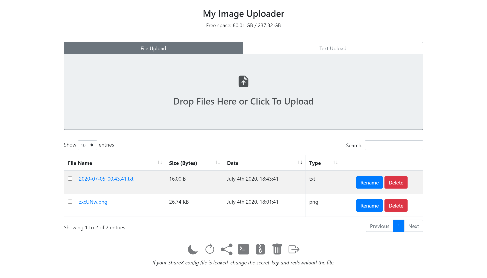
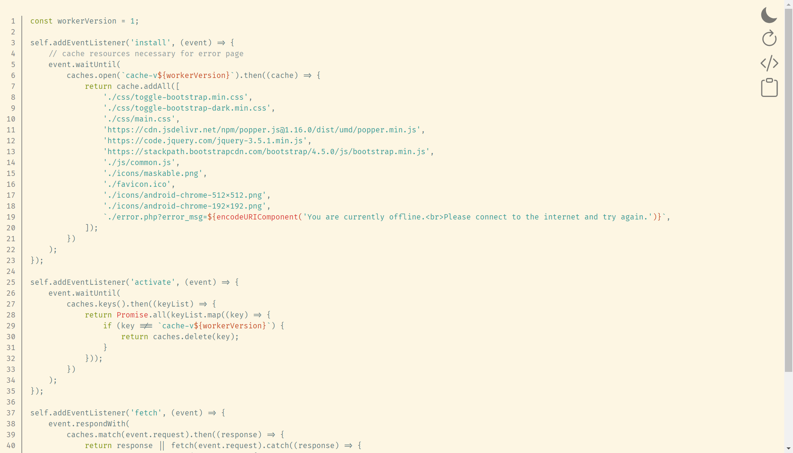

# ShareX-Custom-Upload
A little PHP script created for uploading text, files, and images to your own webserver. It supports uploading via ShareX, but also on the web interface, and with command line scripts.

## Installation
Download the latest release as a ZIP from the [Releases page](https://github.com/JoeGandy/ShareX-Custom-Upload/releases).

Extract the ZIP and follow the [setup instructions](#setup) below.

## Migrating from Version 1
Version 2 introduced major breaking changes that make it incompatible with Version 1 installations. See [the migration guide](MIGRATING.md) for instructions on how to upgrade your uploader.

## NGINX Configuration
By default, this server relies on Apache's `.htaccess` configuration files to function. However, it is possible to configure NGINX to work with the uploader. Please read the [NGINX configuration guide](NGINX.md) for more information.

# Setup
This script requires the `openssl` and `fileinfo` extensions to be enabled in your `php.ini`.

If using Apache, you must also make sure that `mod_rewrite` and `mod_authz_core` are enabled in your `httpd.conf`.

In the `release` folder, edit the `config.php` file to match your setup.
For your site to start working, the only setting you need to change is `base_url`. This will be the URL where your gallery page is accessible.

Then, upload the contents of the `release` folder to your website.

See the [full configuration documentation](#full-configuration) for more information about how to configure your installation.

> **Important:** If you choose to not place your uploader in the root of your website, the `base_url` setting needs to include the path to where the uploader code will be accessible. If you do this and you use Apache, you will also need to to change the `RewriteBase` in the `.htaccess` file to incude the path to your uploader.
> 
> For example, if you want your uploader to be located at `https://mydomain.com/myfileuploads`, you will need to upload the contents of the `release` directory to `/website/root/directory/myfileuploads`, set `base_url` to `https://mydomain.com/myfileuploads` and update the `RewriteBase` line to say `RewriteBase /myfileuploads`

# Updating

To update your uploader to a new version, download the latest release as a ZIP from the [Releases page](https://github.com/JoeGandy/ShareX-Custom-Upload/releases). Extract the `release` folder from the ZIP and upload the folder (not its contents, the folder itself) to your uploader's install directory. For example, if your uploader is installed at `/website/root/directory/`, make sure the folder is at `/website/root/directory/release/`. Now, open the gallery page and a large banner that prompts you to update should appear. If the update is successful, you can then just delete the `release` folder.

> **Important: The automatic updater does not modify any of your configuration files, so if the configuration format is modified in the future, you will need to manually edit your configuration file to match the new format. *Please read the release notes for any new versions and check for any breaking configuration changes*. You can always check [the latest configuration file](src/config.php) for an example of what your configuration should look like.**

If the update banner does not show up, please make sure that the `VERSION` file exists in both your uploader install directory and the `release` directory. The version number in the `release` directory must also be higher than the version number in your current installation.

If you get an error after pressing the upload button, make sure that the folder where your uploader is installed is writable. If that is the case and you still get an error, please [open an issue](https://github.com/JoeGandy/ShareX-Custom-Upload/issues).

> Note: The uploader only supports automatic updating starting with version 2.1.0. If you are currently using a version older than 2.1.0 and want to update, you will need to complete the update manually by copying the new files into your website. However, after you manually update, you will be able to use the automatic updater for future versions.

# Login Configuration

This application supports login using a username and password. If you would like to enable this, set the `enable_password_login` option in your `config.php` to `true`. Now, the next time you open your gallery page, you will be prompted to register an account. Only one account is allowed per installation. It is recommended that you set up your account soon after enabling this setting, since anyone who attempts to view the gallery before an account is set up will be prompted to register.

By default, the website will prompt you for a username and password to log in, but if you would like to only use a password, set the `enable_username` config option to `false`.

> If you have forgotten your password or would like to change it, just delete the `login.json` file in your website's root directory. Do not edit this file directly, since your passwords and authentication tokens are hashed and changing them will corrupt the file.

# ShareX Configuration

To start using your uploader with ShareX, go to your gallery page (which will be at the `base_url` you set in your configuration file) and click on the Share icon at the bottom of the page. This should automatically generate and download a ShareX configuration file. You can now open the file and ShareX should prompt to add your uploader.

## ShareX File Name Templates

The uploader supports using names generated by ShareX's templating system, which allows you to use information about this image to generate your file name. To enable this, you will need to set the `sharex_upload_naming_scheme` to `provided` in your `config.php`. 

To customize the format of this name after adding your uploader to ShareX, you will need to open the `Custom uploader settings` from the `Destinations` menu in the ShareX application. Select the name of your uploader in the `Uploaders` menu. Now, you can edit the value of the  `name` field `Body` table on the right.

This `name` field accepts any valid ShareX name template as a value. You can create a ShareX template string by opening the `Task Settings` menu from the ShareX application, opening the `File naming` tab, and selecting the `Name pattern for capture or clipboard upload` field. A dropdown will open on the right, which you can use to create the template string you want to use. You can then copy the string from this field back into the `name` field from the `Custom uploader settings`.

## Manual Setup
Alternatively, if you have trouble with the above, you can manually add your uploader to ShareX.
1. From the ShareX main application, go to `Destinations` and click on `Custom uploader settings`
2. In the top left corner, press `New` to add a new uploader profile
3. Now, set the Request Method to `POST`
4. Set the URL to your `base_url/upload.php`. For example, if your gallery is at `https://example.com`, set URL to `https://example.com/upload.php`
5. Set `File form name` to `fileupload`
6. Set `Body` to `Form data (multipart/form-data)` and in the table underneath, type in `key` for the name and set the value to the `secure_key` set from your `config.php` file.
7. Set the `Name` field at the top to something you can use to identify your uploader and in the bottom left, choose the profile you created for the Image, File, and Text uploaders.
8. Close the window and in the destinations tab of the main ShareX window, choose the Custom uploader option for the file types you would like to upload. (This application supports Image, File, and Text uploading)

The setup is now complete, test your uploader and it should work!

# Shell Configuration

This uploader also supports text uploading via shell script. To use this feature, click on the Terminal icon on the bottom of your gallery page and select your shell environment. This will download a shell script which will be able to upload piped inputs to your site. Next, follow the steps for your shell environment.

## Bash
Move the downloaded script to `/usr/bin/local`.

## Windows Command Prompt
Move the downloaded script to `C:\Users\yourusername\scripts` (replacing `yourusername` with your Windows user folder).
Then, add that folder to your PATH.

To do this, type `Environment Variables` into Windows Search. Then, in the window that opens, click on the `Environment Variables...` button. Find the `Path` variable in the User variables section, select it, and press Edit. Then press the `New` button and type the path to the folder where your script is located (`C:\Users\yourusername\scripts`). Press Ok to save all your changes and restart the command prompt.

## Powershell
Open your Powershell profile file (the path is stored in the `$PROFILE` variable) and copy the contents of the downloaded script to the end of your profile file. Save the profile and restart Powershell.

## Usage
Now, you can pipe text to the `upload` command and it will return the URL of the uploaded file. You can optionally provide a filename to be used for the upload.

Examples:
```
somecommand | upload
```
```
somecommand | upload myfile.txt
```

# Direct Uploading
Want to upload directly using POST requests? You're in luck! We've got [some documentation](UPLOADING.md).

# Screenshots




# Planned Features
[View the tasks board here](https://github.com/JoeGandy/ShareX-Custom-Upload/projects/1).

# Full Configuration

Below is an explanation of all available configuration options.

## `base_url`

*You must change this.*

This is the most important configuration option. You must set this in order for your site to work. This needs to be set to the location where your uploader site's files can be accessed.

> **Important:** If you choose to not place your uploader in the root of your website, the `base_url` setting needs to include the path to where the uploader code will be accessible. If you do this, you will also need to to change the `RewriteBase` in the `.htaccess` file to incude the path to your uploader.
> 
> For example, if your uploader site's files are located at `/website/root/directory/myfileuploads`, set `base_url` to `https://mydomain.com/myfileuploads` and update the `RewriteBase` line to say `RewriteBase /myfileuploads`

## `secure_key`

*You must change this.*

This sets the token used by ShareX to upload images and files. Since you don't need to memorize this, you should probably set it to something really long and random.

***Important: The `secure_key` cannot contain the `$` character due to limitations of PHP.***

***Note: This is not the password you use to log in to the gallery.***

[Here's a random string generator you can use.](https://www.random.org/strings/?num=1&len=20&digits=on&upperalpha=on&loweralpha=on&unique=on&format=html&rnd=new)

## `file_storage_folder`

*Default Value: `'u/'`*

This sets the directory where your uploads are stored. You really shouldn't have to change this. If you want to change the path where your files are accessible on the site, use the `upload_access_path` config option instead.

> **However, if you change this and you use Apache, you *must* copy the `.htaccess` file from the `u/` directory to your new folder. If you do not do this, people will be able to run arbitrary code on your computer. (This is very bad.)**

## `upload_access_path`

*Default Value: `'/'`*

The sets the path where you will be able to access your uploads from your browser.

Examples:

If you set this to `/` and your `base_url` is `https://www.example.com`, a file called `filename.ext` would be accessible at
`https://www.example.com/filename.ext`

If you set this to `myfiles/`, a file called `filename.ext` would be accessible at `https://www.example.com/myfiles/filename.ext`

***Note: For security reasons, this cannot be the same as your `file_storage_folder`.***

## `zip_storage_folder`

*Default Value: `'backups/'`*

This sets the folder where ZIP backups will be stored.

## `allowed_ips`

*Default Value: `['127.0.0.1', '::1']`*

This sets the IP addresses that are allowed to access the gallery page. However, this does not control who can access your uploads—anyone with a direct link to an file can see it. By default, only clients on the same computer as the host can access the page.

Leave this blank to disable IP blocking.

## `enable_password_login`

*Default Value: `false`*

This sets whether to use the password system to login to the gallery page. Using this setting *will not* disable the `allowed_ips` setting and IP blocking—the two will be used in conjunction.

After the first time you enable this, attempting to view the gallery page will prompt you to create an account.

See the [password login](#login-configuration) section above for more details.

## `enable_username`

*Default Value: `true`*

This sets whether or not you will be prompted to provide a username when you log in. This setting has no effect if `enable_password_login` is `false`. If this setting is disabled, you will only be prompted for your password.

## `remember_me_expiration_days`

*Default Value: `30`*

This controls how long Remember Me tokens are valid for.

When you log in and check the "Remember Me" box, your browser will save a unique identifier and you will not be prompted to log in the next time you visit the uploader. After the number of days specified in this configuration option, this identifier will invalidated and you will need to log in again.

Remember Me tokens will automatically deleted from your browser if you press the Log Out button. This setting only controls how long you will stay signed in for.

## `page_title`

*Default Value: `'My File Uploader'`*

This sets the title shown for the gallery page tab in your browser.

## `heading_text`

*Default Value: `'My File Uploader'`*

This sets the text shown in the header on the gallery page.

## `gallery_date_format`

*Default Value: `'MMMM Do YYYY, HH:mm:ss'`*

This controls the date format used to display file upload dates in the table on the gallery page.

See [the Moment.js format options](https://momentjs.com/docs/#/displaying/format/) for information about how to configure this option.

## `enable_gallery_page_uploads`

*Default Value: `true`*

This controls whether to enable the upload forms on the gallery page.

## `enable_delete_all`

*Default Value: `false`*

This controls whether to enable the option to delete all uploads from the gallery page.

## `enable_delete`

*Default Value: `true`*

This controls whether to show the option to delete individual uploaded files on the gallery page.

## `enable_rename`

*Default Value: `true`*

This controls whether to show the option to rename files from the gallery page.

## `enable_tooltip`

*Default Value: `true`*

This controls whether to show image previews in a tooltip when image links are hovered over on the gallery page.

## `enable_zip_dump`

*Default Value: `false`*

This controls whether to show the option to download all uploads as a ZIP archive. This is untested with large amounts of uploads.

*Note: This option does not control whether you will be able to download uploads as a ZIP using the bulk selector.*

## `enable_rich_text_viewer`

*Default Value: `true`*

This sets whether to show text files in the rich text viewer or send all files raw.

The rich text viewer has theme support, line numbers, and syntax highlighting.

## `sharex_upload_naming_scheme`

*Default Value: `'random'`*

This sets the file naming format to use for ShareX uploads.

Possible values are `keep`, `provided`, `date` and `random`.

Keep mode will keep the file name sent by ShareX.

Provided mode will use the file name sent in the `name` field by ShareX. See the [ShareX Configuration](#sharex-file-name-templates) section for more information about how to set this up.

Date mode will generate a file name based on the date and time of the upload using the format specified in `upload_date_format`.

Random mode will generate a random file name with the length specified in `random_name_length`.

## `gallery_upload_naming_scheme`

*Default Value: `'random'`*

This sets the file naming format to use for gallery uploads.

Possible values are `keep`, `date` and `random`.

Keep mode will keep the name of the uploaded file.

Date mode will generate a file name based on the date and time of the upload using the format specified in `upload_date_format`.

Random mode will generate a random file name with the length specified in `random_name_length`.

## `text_upload_default_naming_scheme`

*Default Value: `'random'`*

This sets the file naming format to use if no file name is provided for a text upload.

Possible values are `date` and `random`.

Date mode will generate a file name based on the date and time of the upload using the format specified in `upload_date_format`.

Random mode will generate a random file name with the length specified in `random_name_length`.

## `random_name_length`

*Default Value: `6`*

This setting sets the length of the random names generated if `random` is chosen as the `default_naming_scheme`.

## `upload_date_format`

*Default Value: `'Y-m-d_H.i.s'`*

This setting sets the format used to generate file names if `date` is set as the `default_naming_scheme`.

See [the PHP date function options](https://www.php.net/manual/en/function.date.php) for information about how to configure this option.

Since this option is used for file names, there is a limited selection of characters which can be used. See the [Wikipedia Filename article](https://en.wikipedia.org/wiki/Filename#Reserved_characters_and_words) for information about what characters can be used in this setting.

## `enable_updater`

*Default Value: `true`*

This controls whether to enable uploader's built in updater.

If enabled, the uploader will prompt you to update when a new version is released and will automatically download and install the update if you agree.

If you disable this, you will need to manually copy the code from the new release to update.

## `enable_update_rollback`

*Default Value: `true`*

This controls whether the uploader should make backups of the old version of the code when performing an update.

If this is enabled, the update will copy the old versions of all modified files to the `rollback` folder. If you an update ever breaks your uploader, you can just go to `<base_url>/rollback/update.php` to roll back the update.

## `enable_image_cache`

*Default Value: `true`*

This controls whether the uploader should instruct the browser to cache the uploaded images.

This is enabled by default, but can slightly hurt performance on low power systems.

## `debug_mode`

*Default Value: `false`*

This enables Debug Mode, which will instruct the uploader to log and send additional debug information.

At the moment, this will only enable sending the time it took to generate image hashes for caching.
